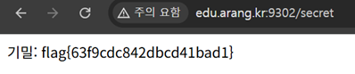

# 14. 2차인증 검증 우

## 문제 설명
로그인 → OTP(2차 인증) → `/secret` 순서로 진행되는 인증 흐름.
정상적으로는 OTP 6자리를 맞춰야 `/secret`에 접근할 수 있으나,
서버가 `/secret` 접근 시 OTP 검증 완료 여부를 확인하지 않는다.

## 분석
로그인(`guest`/`guest`)만 완료한 뒤, OTP 입력 단계를 건너뛰고 `/secret`에
직접 접근했다. 서버가 "OTP 인증 완료" 상태를 검증하지 않아 그대로 페이지가 노출된다.
(접근 제어를 각 단계가 아니라 화면 흐름에만 의존한 전형적인 인증 우회)

## 익스플로잇

### 방법
1. 로그인 페이지에서 `guest` / `guest` 로 로그인한다.
2. OTP 입력을 건너뛰고 주소창에 `/secret` 을 직접 입력해 접근한다.

```
http://edu.arang.kr:9302/secret
```

OTP 검증 없이 기밀 페이지가 노출되며 flag가 표시된다.



## 플래그
```
flag{63f9cdc842dbcd41bad1}
```
