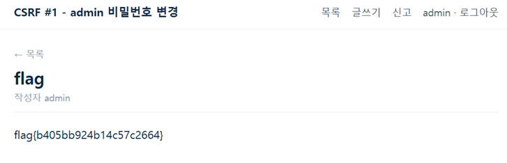

# 06. CSRF_01

## 문제 설명
게시판(글쓰기·신고)이 있고, 신고 시 admin 봇이 해당 URL을 방문한다.
0번 게시글(`flag`, 작성자 admin)은 admin 권한으로만 볼 수 있다.

## 분석
비밀번호를 변경할 수 있을거라고 생각해서 url에 여러 가지 찔러보다가 발견함.
- 비밀번호 변경: `/changepw?userid=<대상>&userpw=<새 비번>`
- 게시글은 HTML을 렌더링하므로, `` 태그로 GET 요청을 자동 발생시킬 수 있다.
- 게시글 본문에 `` 형태(따옴표 + `/` 시작 경로)는 필터에 차단되지만,
  따옴표를 제거하면 우회된다.

## 익스플로잇

### 페이로드 (글쓰기 본문)
```html

```
admin 봇이 이 글을 열면 봇의 세션으로 `/changepw?userid=admin&userpw=123` 요청이
발생하여 admin 비밀번호가 `123`으로 변경된다.

### 공격 흐름
1. 위 페이로드로 글을 작성하고 글 번호(`/board/N`)를 확인한다.
2. 신고(`/report`)에 해당 글의 내부 주소(`http://<내부주소>/board/N`)를 제출한다.
3. admin 봇이 글을 방문 → `` 로딩으로 비밀번호 변경 요청 실행 → admin 비번이 `123`으로 변경.
4. `admin` / `123` 으로 로그인한다.
5. admin 권한으로 0번 글(`/board/0`)을 열어 flag를 확인한다.



## 플래그
```
flag{b405bb924b14c57c2664}
```
