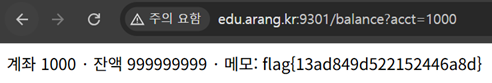

# 04. IDOR — 계좌 잔액 조회

## 문제 설명
guest 계정으로 로그인하면 본인 계좌(`1001`)의 잔액을 조회할 수 있다.
잔액조회 폼은 `acct` 파라미터로 계좌번호를 `/balance`에 전달한다.

## 분석
`/balance`는 요청한 `acct` 계좌가 로그인한 사용자의 소유인지 검증하지 않고,
전달된 계좌번호의 정보를 그대로 반환한다. 따라서 `acct` 값을 다른 번호로 바꾸면
타인의 계좌 정보가 조회된다. (IDOR)

## 익스플로잇

### 페이로드 (`acct` 값)
```
1000
```
본인 계좌(`1001`) 대신 느낌적으로 `1000`을 조회하면 다른 계좌의 잔액과 메모가 노출되며,
메모 자리에 flag가 들어 있다.

```
계좌 1000 · 잔액 999999999 · 메모: flag{13ad849d522152446a8d}
```



## 플래그
```
flag{13ad849d522152446a8d}
```
