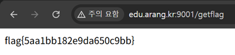

# 15. 은행 인증우회 - Basic

## 문제 설명
계좌 잔액이 1,000,000,000(10억)을 초과하면 `/getflag`에서 flag를 주는 은행 서비스.
초기 잔액은 10000원이며, 이체 기능을 악용해 잔액을 조작해야 한다.

```javascript
if(balance > 1000000000){
    alert("Congratulation! You will get flag ...");
    location = "/getflag";
}
```

## 분석
- 이체 폼(`/transfer`)은 `to_address`(대상 계좌), `amount`(금액) 두 값만 받는다.
- `amount`가 `type="text"`이고 서버가 양수 검증을 하지 않아 음수 이체가 가능하다.
- 거래내역(`/transfer_history`)에서 admin의 계좌번호가 노출된다.
  ```
  admin (c92b31da-6085-4f66-b1a0-238dac080bdd)
  ```

이체는 "내 잔액 -= amount"로 처리되므로, `amount`에 음수를 넣으면
`내 잔액 -= (음수)` = 내 잔액이 증가한다.

## 익스플로잇

### 이체 (음수 금액)
```
이체 대상 계좌번호: c92b31da-6085-4f66-b1a0-238dac080bdd   (admin 계좌)
금액: -1000000001
```
`amount`가 음수이므로 내 잔액이 10억 이상으로 증가한다.

### flag 획득
마이페이지(`/my`) 접근 시 잔액이 10억을 초과하여 안내 alert이 뜨고,
`/getflag`로 이동하면 flag가 표시된다.
```
http://edu.arang.kr:9001/getflag
```



## 플래그
```
flag{5aa1bb182e9da650c9bb}
```
